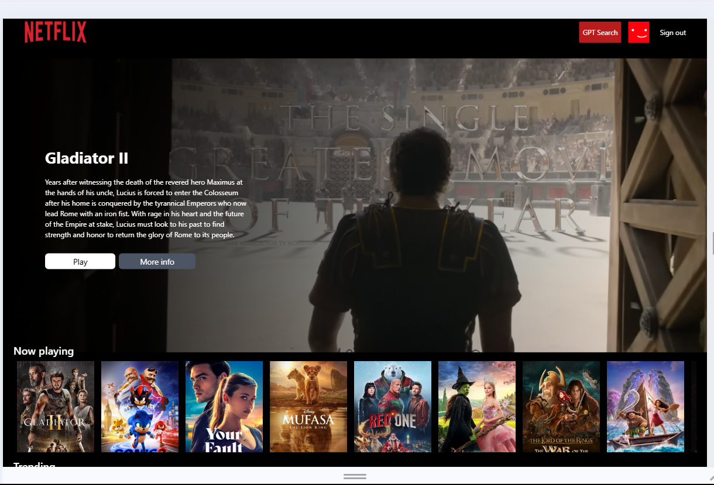
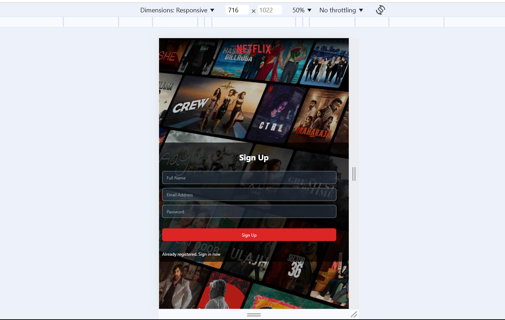

# Netflix clone

Frontend for Netflix-like application that provides users with a movie suggestions. The app integrates Firebase for user authentication, uses the TMDB API for fetching movie data, leverages Redux for state management, and incorporates GPT to provide personalized movie suggestions.

# Features:

## User Authentication

- Registration and login : Secure user authentication using firebase

## TMDB API integration

- Fetches data for popular, upcoming, trending etc., movies content

## GPT integration

- Integrated with GPT to offer tailored movie recommendations based on user preferences.

## State management using Redux

- Efficient state management for: Fetching datafrom TMDB

## Intuitive UI

- User interface inspired by netflix
- Features a responsive layout for both desktop and mobile screens.

# Screenshots

## For Web

- Sign up Page
  

- Login Page
  

- Main Page
  

- GPT Search Page
  
  
- Movie cards:
  

## For Mobile:

Sign up Page

- 

- Login Page
  

- Main Page
  

- GPT Search Page
  

# Technologies used:

List of tools, libraries and frameworks used in the project

- Frontend: React, Redux, Tailwind CSS
- Backend: Firebase
- API: TMDB, ChatGPT
- Deployment: Render

## Frontend:

- React: Component based architecture for building the user interface
- Redux: For managing and synchronising application state
- Tailwind CSS : For styling and ensuring responsive layout

## Backend:

- Firebase: User authentication for secure sign-in and registration

## API Integration:

- TMDB API: Fetches movies data
- GPT API: Offers personalized movie recommendations based on inputs from user

# Installation

1. Clone the repository
   git clone https://github.com/monikakhanka/netflix-gpt.git
2. Navigate to the project directory
   cd netflix-gpt
3. Install dependencies
   npm install
4. create .env file with following environment variable and copy the keys from your account:
   REACT_APP_TMDB_KEY=ahjhjskjksj
   EACT_APP_OPENAI_KEY=ankkajkjakja
5. Start the development server
   npm start dev

## How it works

Steps to use the app:

1. Sign up:

- Create a profile by entering Name, Email Id and Password.
- On successful sign up, main page opens up.

2. Log in:

- If the user already exist, then login using Email Id and Password.
- On successful log user is directed to main page

3. Main page:

- Displays one movie trailer in background and discription related to it
- Displays movie cards based on different categories: Most popular, Now playing, trending, horror etc.

3. GPT Search:

- On clicking GPT search button on the top, the search page opens up
- Enter the prompt for movie for eg. Old thriller romantic movie
- The movie cards based on the suggestions are displayed on the page

4. Logout:

- For logging out the user
